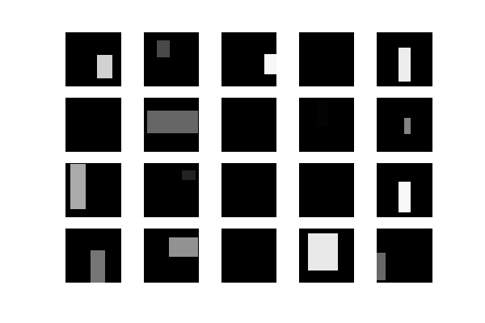
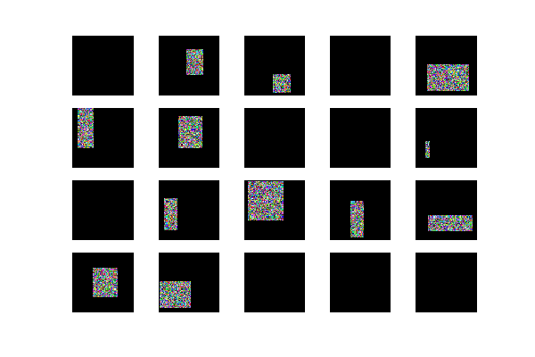

# Cutout / Random Erasing
This is a Cutout [1] / Random Erasing [2] implementation.
In particular, it is easily used with ImageDataGenerator in Keras.
Please check [random_eraser.py](random_eraser.py) for implementation details.

## About Cutout / Random Erasing
Cutout or Random Erasing is a kind of image augmentation methods
for convolutional neural networks (CNN).
They are very similar methods and were proposed almost at the same time.

They try to regularize models using training images
that are randomly masked with random values.





## Usage
### With ImageDataGenerator in Keras
It is very easy to use if you are using ImageDataGenerator in Keras;
get `eraser` function by `get_random_eraser()`,
and then pass it to `ImageDataGenerator` as `preprocessing_function`.
By doing so, all images are randomly erased *before* standard augmentation
done by ImageDataGenerator.

Please check [cifar10_resnet.py](cifar10_resnet.py),
which is imported from [official Keras examples](https://github.com/fchollet/keras/tree/master/examples).

What I did is adding only two lines:

```python
...
from random_eraser import get_random_eraser  # added
...

    datagen = ImageDataGenerator(
    ...
        preprocessing_function=get_random_eraser(v_l=0, v_h=1))  # added
```

### Erase a single image
Of cause, you can erase a single image using `eraser` function.
Please note that `eraser` function works in inplace mode;
the input image itself will be modified (therefore, `img = eraser(img)` can be replaced by `eraser(img)` in the following example).

```python
from random_eraser import get_random_eraser
eraser = get_random_eraser()

# load image to img
img = eraser(img)
```

Pleae check [example.ipynb](example.ipynb) for complete example.

### Parameters
Parameters are fully configurable as:

```
get_random_eraser(p=0.5, s_l=0.02, s_h=0.4, r_1=0.3, r_2=1/0.3,
                  v_l=0, v_h=255, pixel_level=False)
```

- `p` : the probability that random erasing is performed
- `s_l`, `s_h` : minimum / maximum proportion of erased area against input image
- `r_1`, `r_2` : minimum / maximum aspect ratio of erased area
- `v_l`, `v_h` : minimum / maximum value for erased area
- `pixel_level` : pixel-level randomization for erased area


## Results
The original `cifar10_resnet.py` result (w/o cutout / random erasing):

```
Test loss: 0.539187009859
Test accuracy: 0.9077
```

With cutout / random erasing:

```
Test loss: 0.445597583055
Test accuracy: 0.9182
```

With cutout / random erasing (pixel-level):

```
Test loss: 0.446407950497
Test accuracy: 0.9213
```


## References
[1] T. DeVries and G. W. Taylor, "Improved Regularization of Convolutional Neural Networks with Cutout," in arXiv:1708.04552, 2017.

[2] Z. Zhong, L. Zheng, G. Kang, S. Li, and Y. Yang, "Random Erasing Data Augmentation," in arXiv:1708.04896, 2017.
